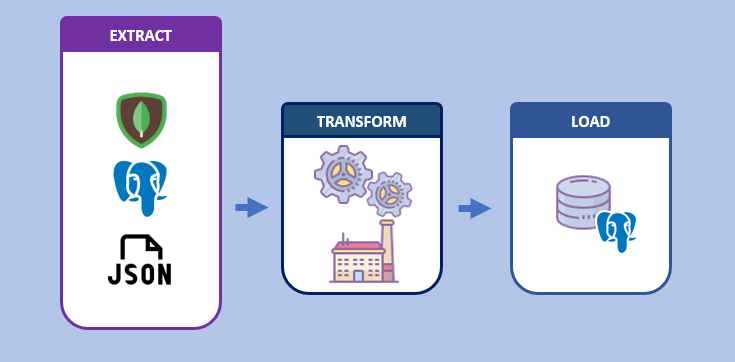

<!--
*** Thanks for checking out the Best-README-Template. If you have a suggestion
*** that would make this better, please fork the repo and create a pull request
*** or simply open an issue with the tag "enhancement".
*** Don't forget to give the project a star!
*** Thanks again! Now go create something AMAZING! :D
-->

<!-- PROJECT LOGO -->
 

  

  <h3 align="center">Apache Airflow DAG - Multisource ETL</h3>

  

    ETL project that handles multiple data sources in parallel and encapsulates Python scripts for better code control
     
    <a href="https://github.com/marioghz/airflow_etl_multisource/tree/main/include"><strong>Explore the docs »</strong></a>
     
     
    
  

<!-- TABLE OF CONTENTS -->

  
Table of Contents

  <ol>
    <li>
      <a href="#about-the-project">About The Project</a>
      <ul>
        <li><a href="#built-with">Built With</a></li>
      </ul>
    </li>
    <li><a href="#contributing">Contributing</a></li>
    <li><a href="#contact">Contact</a></li>
    <li><a href="#acknowledgments">Acknowledgments</a></li>
  </ol>

<!-- ABOUT THE PROJECT -->
## About The Project

The project's intention is to define a code base for ETL processes, using different techniques and technologies to perform a simple data load isolated from the Python code within the Apache Airflow orchestrator. This design architecture allows some of the following features:

Some of them:

* Separate .py document for each payload type
* Parallelism of data loading in Airflow
* Control and reuse of BDs connection methods
* Development speed
* More efficient error identification

Ideally, the project seeks to grow and improve in features and new data sources within the same Apache Airflow environment as a Python execution manager, in addition to reinforcing what has to do with the security, error handling and scalability of the project.

(<a href="#top">back to top</a>)

### Built With

This section list any major frameworks/libraries/technologies used on this project. Here are a few examples for your reference.

* [Airflow](https://airflow.apache.org/)
* [Python](https://www.python.org/)
* [Docker](https://www.docker.com/)
* [Mongodb](https://www.mongodb.com/)
* [Postgresql](https://www.postgresql.org/)
* [Pandas.py](https://pypi.org/project/pandas/)

(<a href="#top">back to top</a>)

<!-- CONTRIBUTING -->
## Contributing

Contributions are what make the open source community such an amazing place to learn, inspire, and create. Any contributions you make are **greatly appreciated**.

If you have a suggestion that would make this better, please fork the repo and create a pull request. You can also simply open an issue with the tag "enhancement".
Don't forget to give the project a star! Thanks again!

1. Fork the Project
2. Create your Feature Branch (`git checkout -b feature/AmazingFeature`)
3. Commit your Changes (`git commit -m 'Add some AmazingFeature'`)
4. Push to the Branch (`git push origin feature/AmazingFeature`)
5. Open a Pull Request

(<a href="#top">back to top</a>)

<!-- CONTACT -->
## Contact

Mario Herrera Zamora - [mario-herrera-zamora](https://www.linkedin.com/in/mario-herrera-zamora/) - marioherrez@gmail.com

Project Link: [airflow_etl_multisource](https://github.com/marioghz/airflow_etl_multisource)

(<a href="#top">back to top</a>)

<!-- ACKNOWLEDGMENTS -->
## Acknowledgments

Use this space to list resources you find helpful and would like to give credit to. I've included a few of my favorites to kick things off!

* [how-to-start-with-apache-airflow-in-docker-windows](https://medium.com/@garc1a0scar/how-to-start-with-apache-airflow-in-docker-windows-902674ad1bbe)
* [Icons](https://icons8.com/icon/set/logos/color)

(<a href="#top">back to top</a>)

